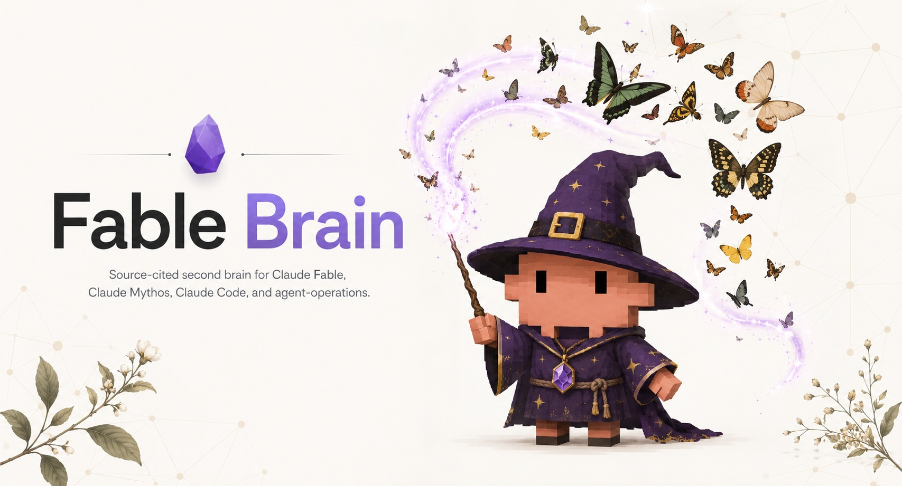
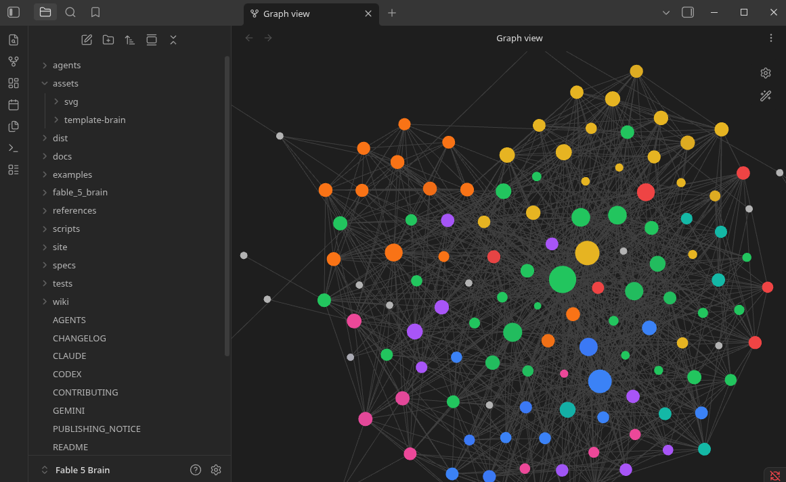
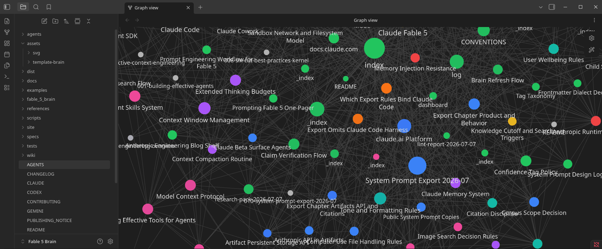

# Fable 5 Brain

<p align="center">
  
</p>

Public, source-cited Obsidian brain for Claude Fable 5, Claude Mythos 5,
Project Glasswing, Claude Code, and current agent-operations practice.

This is a public research repository. It is not affiliated with, endorsed by, or
sponsored by Anthropic, and its content is derived from public sources.

> Public research repository. Not affiliated with, endorsed by, or sponsored by
> Anthropic. Content is derived from public sources. Raw operator captures,
> private notes, API credentials, and account-specific exports are omitted from
> this public release.

## Status

- Maturity: market-ready by `python scripts/audit_brain.py --require market-ready`
- Current wiki pages: 109
- Current source ledger entries: 96
- Current claim-ledger rows: 187
- Canonical operator entrypoint: `SKILL.md`
- Canonical vault entrypoint: `wiki/hot.md`

## What This Is

Fable 5 Brain is a working knowledge vault and agent operating layer. It turns
dated public sources, public-safe corpus metadata, and verified claims into:

- Obsidian notes with frontmatter, wikilinks, source URLs, and confidence tags.
- Operator playbooks for Claude Fable 5, Mythos-class models, and Claude Code.
- Source and claim ledgers that make factual drift visible.
- Audit scripts that gate the brain before it is called market-ready.
- A sanitized static landing page in `site/` for GitHub Pages-style publishing.

The brain is advisory. It does not mutate accounts, production systems,
pipelines, books, customer records, or live infrastructure.

## Knowledge Graph

Every note carries frontmatter, wikilinks, and source citations, so the vault
forms one densely connected Obsidian graph. Navigation stays fast and factual
drift stays visible.

<p align="center">
  
</p>

<p align="center">
  
</p>

## Buyer, Outputs, Boundaries

The buyer for this repository is an operator, research owner, or agent team
that needs a verifiable second brain for Fable, Mythos, Claude Code, and
related agent practice.

The expected outputs are a navigable Obsidian vault, source and claim ledgers,
operator playbooks, audit scripts, reusable templates, and a sanitized
GitHub Pages landing page.

The boundaries are explicit: this brain is advisory, source-cited, and
read-only by default. It does not grant rights to third-party material, publish
raw captures, make legal claims, or automate changes to live systems without a
separate approval and rollback process.

## Publish Safety

This repository contains research about public prompt material and public
discussion of prompt mirrors. Public availability does not automatically grant
copyright, trademark, confidentiality, or redistribution rights. This is not
legal advice.

Rules before pushing or publishing:

- Keep `.raw/` source captures out of Pages, releases, and public ZIPs.
- Do not publish API keys, account exports, cookies, tokens, private user data,
  or local machine secrets.
- Keep GitHub Pages sanitized. The `site/` folder is designed for public-safe
  summary content only.
- Treat Anthropic, Claude, Fable, Mythos, and Project Glasswing names as third
  party marks and use them only descriptively.

See `PUBLISHING_NOTICE.md` for the rights and provenance policy.

## Repository Map

```text
.
|-- .github/                 # manual GitHub Pages workflow
|-- .claude-plugin/          # Claude Code plugin and marketplace metadata
|-- SKILL.md                 # agent entrypoint and operating procedure
|-- CODEX.md                 # vault runtime instructions
|-- wiki/                    # Obsidian brain, notes, hubs, hot cache
|-- references/              # source ledger, claim ledger, canon, adapters
|-- docs/                    # operator docs and product boundaries
|-- agents/                  # agent templates and handoff material
|-- specs/                   # Brainstein project spec
|-- fable_5_brain/           # Python package and CLI
|-- scripts/                 # audit, package, scaffold, visual/report tools
|-- tests/                   # import/export and pipeline checks
|-- examples/sample-vault/   # deterministic demo vault
|-- assets/                  # template brain assets and SVGs
|-- images/                  # repository cover and graph images
|-- site/                    # sanitized Quartz site and content mirror
|-- install.sh               # local install helper
|-- uninstall.sh             # local uninstall helper
`-- .raw/                    # public stub; raw captures omitted
```

Folder guides:

- `wiki/README.md`
- `references/README.md`
- `site/README.md`
- `.raw/README.md`

## How It Works

1. Public source material enters `references/source-ledger.json`; private raw
   captures stay outside this public release.
2. Claims are verified into `references/claim-ledger.md`.
3. Wiki notes cite sources and carry confidence tags.
4. Hubs, `wiki/hot.md`, `wiki/index.md`, and `wiki/overview.md` keep navigation
   current.
5. Audits enforce source coverage, Obsidian hygiene, adapters, tests, docs, and
   product clarity.

The working doctrine is simple: no source, no claim. No verification path, no
release.

## Core Topics

- Claude Fable 5 model behavior, pricing, refusals, fallback, and adaptive
  thinking.
- Claude Mythos 5 and the Mythos-class model tier.
- Project Glasswing, trusted access, and dual-use safety posture.
- Claude Code workflows: CLAUDE.md, hooks, subagents, skills, permissions,
  sandboxing, MCP, and headless usage.
- Prompting, context engineering, source-led research, and multi-agent fan-out.
- Public prompt-copy corroboration and GitHub leak-sweep findings.

## Quick Start

```bash
python -m pip install -e .
python scripts/lint_vault.py --vault .
python scripts/audit_brain.py --require market-ready
```

Demo vault:

```bash
fable-5-brain demo
fable-5-brain lint --vault examples/sample-vault
fable-5-brain visuals --vault examples/sample-vault
fable-5-brain report --vault examples/sample-vault --html-only
```

Create a client vault:

```bash
fable-5-brain new acme --client-name "Acme Co" --owner "Your Name" --out-dir ~/fable-5-brain-vaults
fable-5-brain ingest --vault ~/fable-5-brain-vaults/acme --file tests/fixtures/sample-source.md
fable-5-brain synthesize --vault ~/fable-5-brain-vaults/acme
fable-5-brain visuals --vault ~/fable-5-brain-vaults/acme
fable-5-brain report --vault ~/fable-5-brain-vaults/acme --html-only
fable-5-brain next --vault ~/fable-5-brain-vaults/acme
```

## Verification

```bash
python -m compileall scripts fable_5_brain tests
python tests/test_import_export.py
python scripts/lint_vault.py --vault .
python scripts/audit_brain.py --json
python scripts/audit_brain.py --require market-ready
```

Release packaging is intentionally stricter and requires a clean reproducible
worktree:

```bash
python scripts/package_release.py --version 0.1.0
python scripts/package_release.py --version 1.0.0 --release-type market-ready
```

## GitHub Pages

A browsable vault site can be built from `site/` and deployed with the manual
workflow at `.github/workflows/pages.yml`. Enable GitHub Pages on the repository
first, then set `baseUrl` in `site/quartz.config.ts` to match.

The site excludes `.obsidian`, `hot.md`, and `log.md`; the accounts section
contains only public-safe tier information. It must never expose raw captures,
full prompt material, ledgers, credentials, tokens, or local machine paths.

GitHub's own docs warn that Pages visibility is separate from repository
visibility and can make a site public even when the repository is private.
Confirm the desired Pages visibility in repository settings before running the
manual workflow.

## License

Code in this repository is licensed under the MIT License. Vault content is
licensed under Creative Commons Attribution 4.0 International (CC BY 4.0), as
described in `LICENSE-CONTENT.md`.

Third-party source material, product names, documentation excerpts, and cited
public artifacts remain the property of their respective owners and are not
relicensed by this repository.

## Community and Support

Questions, updates, and operator support for this brain live in the AI Marketing
Hub Pro community: https://www.skool.com/ai-marketing-hub-pro. Community
membership is required.

Use GitHub Issues for bugs and repository questions. See `SUPPORT.md` for
support details, `SECURITY.md` for sensitive reports, and `CONTRIBUTING.md` for
contribution workflow.
